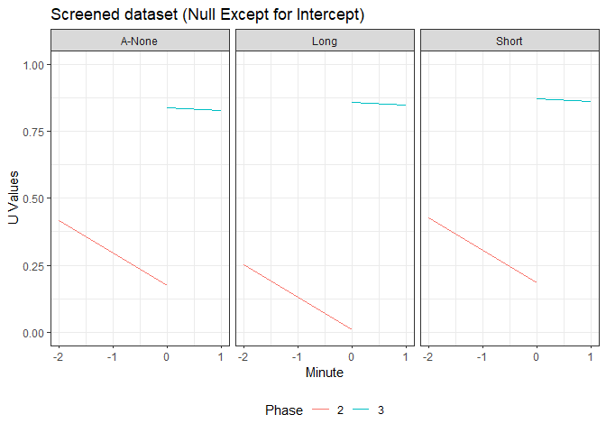
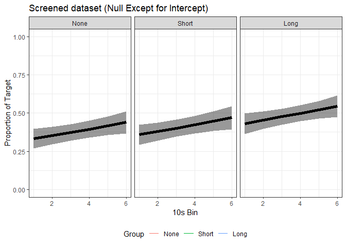

## Examining Effects of Training Duration on Humans’ Resurgence and Variability Using a Novel Touchscreen Procedure

## Authors

-   Carolyn M. Ritchey (Auburn University)

-   Yuto Mizutani (Aichi Gakuin University)

-   Toshikazu Kuroda (Huckle Co., Ltd., Aichi, Japan; Aichi Bunkyo
    University)

-   Shawn Gilroy (Louisiana State University)

-   Christopher A. Podlesnik (Auburn University)

## Abstract

Resurgence occurs when a previously reinforced and then extinguished
target response increases due to reducing/eliminating an alternative
source of reinforcement or punishing an alternative response. We
evaluated whether duration of reinforcement history for a target
response (1) affects the degree to which a resurgence effect is observed
in humans and (2) produces different gradients of response
generalization around target responding during extinction testing. We
arranged a novel touchscreen interface in which university students
could swipe a 3D soccer ball to spin any direction. In Phase 1, the
first direction swiped became the target and produced points
exchangeable for money for 3 or 1 min across two groups. The first swipe
was recorded but had no programmed consequence in a third group. In
Phase 2, swipes 180-degrees from the target resulted in points for 3 min
in all groups. Point deliveries ceased for 2 min to test for resurgence
in Phase 3. Target responses resurged during testing to a relatively
greater extent with longer Phase-1 training but gradients of response
generalization did not differ among groups. These findings extend prior
research on the role of training duration on resurgence. We discuss
methodological and conceptual issues surrounding the assessment of
response generalization in resurgence.

## Included files

Data:

-   Swipe U Value.csv (Phase-level U values calculated for each
    individual/phase)

-   RawDataOG\_ALL.csv (Pre-binned and cleaned data with responding
    across individuals)

-   swipedataanglesall.csv (Raw data regarding swipes from participants
    with clean data)

-   swipedataanglesallfull.csv (Raw data regarding swipes from all
    participants)

## Study Results (with and without data cleaning)

### Descriptives (U-values)

    ## Warning in Ops.factor(as.factor(Group), as.factor(Phase)): '*' not meaningful
    ## for factors

    ##           Model df       AIC       BIC   logLik   Test  L.Ratio p-value
    ## fullModel     1 14 -74.21505 -32.06616 51.10753                        
    ## rstModl.1     2 12 -77.17708 -41.04946 50.58854 1 vs 2 1.037973  0.5951

    ##           Model df       AIC       BIC   logLik   Test   L.Ratio p-value
    ## rstModl.1     1 12 -77.17708 -41.04946 50.58854                         
    ## rstModl.2     2 10 -80.61034 -50.50399 50.30517 1 vs 2 0.5667352  0.7532

    ##           Model df       AIC       BIC   logLik   Test  L.Ratio p-value
    ## rstModl.2     1 10 -80.61034 -50.50399 50.30517                        
    ## rstModl.3     2  9 -76.98331 -49.88759 47.49165 1 vs 2 5.627035  0.0177

    ##           Model df       AIC       BIC   logLik   Test  L.Ratio p-value
    ## rstModl.3     1  9 -76.98331 -49.88759 47.49165                        
    ## rstModl.4     2  7 -72.43691 -51.36246 43.21845 1 vs 2 8.546402  0.0139

    ## Generalized least squares fit by maximum likelihood
    ##   Model: Uvalue ~ Group + Phase + Time + Group:Phase + Phase:Time 
    ##   Data: uData.grp 
    ##         AIC       BIC   logLik
    ##   -80.61034 -50.50399 50.30517
    ## 
    ## Correlation Structure: Compound symmetry
    ##  Formula: ~1 | id 
    ##  Parameter estimate(s):
    ##       Rho 
    ## 0.1604128 
    ## 
    ## Coefficients:
    ##                       Value  Std.Error   t-value p-value
    ## (Intercept)      -1.1582329 0.14264819 -8.119507  0.0000
    ## GroupLong        -0.5311363 0.16944840 -3.134502  0.0021
    ## GroupShort       -0.0291801 0.16944840 -0.172206  0.8635
    ## Phase             0.6655619 0.05680254 11.717115  0.0000
    ## Time             -0.3462427 0.10734672 -3.225462  0.0016
    ## GroupLong:Phase   0.1835418 0.06789202  2.703436  0.0077
    ## GroupShort:Phase  0.0202500 0.06789202  0.298267  0.7659
    ## Phase:Time        0.1121123 0.04800691  2.335337  0.0209
    ## 
    ##  Correlation: 
    ##                  (Intr) GrpLng GrpShr Phase  Time   GrpL:P GrpS:P
    ## GroupLong        -0.594                                          
    ## GroupShort       -0.594  0.500                                   
    ## Phase            -0.967  0.575  0.575                            
    ## Time              0.030  0.000  0.000  0.076                     
    ## GroupLong:Phase   0.571 -0.962 -0.481 -0.598  0.000              
    ## GroupShort:Phase  0.571 -0.481 -0.962 -0.598  0.000  0.500       
    ## Phase:Time        0.067  0.000  0.000 -0.169 -0.984  0.000  0.000
    ## 
    ## Standardized residuals:
    ##         Min          Q1         Med          Q3         Max 
    ## -1.97265836 -0.68284378 -0.05004944  0.48000499  3.15371116 
    ## 
    ## Residual standard error: 0.1765875 
    ## Degrees of freedom: 150 total; 142 residual

<!-- -->

### RQ1: To what degree does the duration of target-reinforcement history in Phase 1 influence observed rates of resurgence as target responses as a proportion of previously reinforced responses (i.e., Target, Alternative)?

#### Screened Set

<table class="table" style="margin-left: auto; margin-right: auto;">
<caption>
RE Comparisons (RE.NO Selected)
</caption>
<thead>
<tr>
<th style="text-align:left;">
</th>
<th style="text-align:right;">
df
</th>
<th style="text-align:right;">
AICc
</th>
</tr>
</thead>
<tbody>
<tr>
<td style="text-align:left;">
RE.NO
</td>
<td style="text-align:right;">
7
</td>
<td style="text-align:right;">
-64.64782
</td>
</tr>
<tr>
<td style="text-align:left;">
RE.1
</td>
<td style="text-align:right;">
8
</td>
<td style="text-align:right;">
-45.31231
</td>
</tr>
<tr>
<td style="text-align:left;">
RE.2
</td>
<td style="text-align:right;">
10
</td>
<td style="text-align:right;">
-46.01915
</td>
</tr>
</tbody>
</table>

Model evaluations suggested that beta regression alone \[RE.NO\],
without random effects, best characterized the available data.

<table class="table" style="margin-left: auto; margin-right: auto;">
<caption>
FE Comparisons (FE.1 Selected, no interaction)
</caption>
<thead>
<tr>
<th style="text-align:left;">
</th>
<th style="text-align:right;">
df
</th>
<th style="text-align:right;">
AICc
</th>
</tr>
</thead>
<tbody>
<tr>
<td style="text-align:left;">
FE.0
</td>
<td style="text-align:right;">
7
</td>
<td style="text-align:right;">
-64.64782
</td>
</tr>
<tr>
<td style="text-align:left;">
FE.1
</td>
<td style="text-align:right;">
5
</td>
<td style="text-align:right;">
-67.74101
</td>
</tr>
</tbody>
</table>

<!-- -->

    ## 
    ## Call:
    ## betareg(formula = Proportion ~ Time + Group, data = colData, na.action = na.omit, 
    ##     link = "logit")
    ## 
    ## Standardized weighted residuals 2:
    ##     Min      1Q  Median      3Q     Max 
    ## -2.8935 -0.5648 -0.0018  0.6609  2.9298 
    ## 
    ## Coefficients (mean model with logit link):
    ##             Estimate Std. Error z value Pr(>|z|)    
    ## (Intercept) -0.79417    0.17448  -4.552 5.32e-06 ***
    ## Time         0.09173    0.03820   2.401  0.01635 *  
    ## GroupShort   0.11921    0.16304   0.731  0.46469    
    ## GroupLong    0.42148    0.15456   2.727  0.00639 ** 
    ## 
    ## Phi coefficients (precision model with identity link):
    ##       Estimate Std. Error z value Pr(>|z|)    
    ## (phi)   5.3442     0.5626   9.499   <2e-16 ***
    ## ---
    ## Signif. codes:  0 '***' 0.001 '**' 0.01 '*' 0.05 '.' 0.1 ' ' 1 
    ## 
    ## Type of estimator: ML (maximum likelihood)
    ## Log-likelihood: 39.07 on 5 Df
    ## Pseudo R-squared: 0.08482
    ## Number of iterations: 12 (BFGS) + 3 (Fisher scoring)

#### Unscreened Set

<table class="table" style="margin-left: auto; margin-right: auto;">
<caption>
RE Comparisons (RE.1 Selected)
</caption>
<thead>
<tr>
<th style="text-align:left;">
</th>
<th style="text-align:right;">
df
</th>
<th style="text-align:right;">
AICc
</th>
</tr>
</thead>
<tbody>
<tr>
<td style="text-align:left;">
RE.NO
</td>
<td style="text-align:right;">
7
</td>
<td style="text-align:right;">
-104.8066
</td>
</tr>
<tr>
<td style="text-align:left;">
RE.1
</td>
<td style="text-align:right;">
8
</td>
<td style="text-align:right;">
-115.2665
</td>
</tr>
<tr>
<td style="text-align:left;">
RE.2
</td>
<td style="text-align:right;">
10
</td>
<td style="text-align:right;">
-113.1423
</td>
</tr>
</tbody>
</table>

Model evaluations suggested that beta regression with random intercepts
(ID) best characterized the data.

<table class="table" style="margin-left: auto; margin-right: auto;">
<caption>
FE Comparisons (FE.1 Selected, no interaction)
</caption>
<thead>
<tr>
<th style="text-align:left;">
</th>
<th style="text-align:right;">
df
</th>
<th style="text-align:right;">
AICc
</th>
</tr>
</thead>
<tbody>
<tr>
<td style="text-align:left;">
FE.0
</td>
<td style="text-align:right;">
8
</td>
<td style="text-align:right;">
-132.3532
</td>
</tr>
<tr>
<td style="text-align:left;">
FE.1
</td>
<td style="text-align:right;">
6
</td>
<td style="text-align:right;">
-136.2830
</td>
</tr>
</tbody>
</table>

<!-- -->

    ##  Family: beta  ( logit )
    ## Formula:          Proportion ~ Time + Group + (1 | UID)
    ## Data: database.organized
    ## 
    ##      AIC      BIC   logLik deviance df.resid 
    ##   -136.7   -116.6     74.3   -148.7      203 
    ## 
    ## Random effects:
    ## 
    ## Conditional model:
    ##  Groups Name        Variance Std.Dev.
    ##  UID    (Intercept) 0.2655   0.5152  
    ## Number of obs: 209, groups:  UID, 40
    ## 
    ## Overdispersion parameter for beta family (): 6.99 
    ## 
    ## Conditional model:
    ##                  Estimate Std. Error z value Pr(>|z|)   
    ## (Intercept)       0.58137    0.19508   2.980  0.00288 **
    ## Time              0.06128    0.03194   1.919  0.05505 . 
    ## GroupGroup None  -0.15027    0.24518  -0.613  0.53995   
    ## GroupGroup Short -0.04675    0.22896  -0.204  0.83820   
    ## ---
    ## Signif. codes:  0 '***' 0.001 '**' 0.01 '*' 0.05 '.' 0.1 ' ' 1

### RQ2: Does the duration of target-reinforcement history in Phase 1 contribute to different gradients of non-reinforced/control responding around targeted responding when undergoing extinction of alternative responding?

#### Screened Set

<!-- -->

<!-- --><!-- -->

<table class="table" style="margin-left: auto; margin-right: auto;">
<caption>
Reference Swipe (Screened)
</caption>
<thead>
<tr>
<th style="text-align:left;">
Group
</th>
<th style="text-align:right;">
Ave
</th>
<th style="text-align:right;">
sd
</th>
</tr>
</thead>
<tbody>
<tr>
<td style="text-align:left;">
Group Long
</td>
<td style="text-align:right;">
-0.4083333
</td>
<td style="text-align:right;">
11.96327
</td>
</tr>
<tr>
<td style="text-align:left;">
Group Short
</td>
<td style="text-align:right;">
0.2309142
</td>
<td style="text-align:right;">
11.64014
</td>
</tr>
<tr>
<td style="text-align:left;">
Group None
</td>
<td style="text-align:right;">
-0.2140871
</td>
<td style="text-align:right;">
11.83293
</td>
</tr>
</tbody>
</table>
<table class="table" style="margin-left: auto; margin-right: auto;">
<caption>
Levenes Test (Screened)
</caption>
<thead>
<tr>
<th style="text-align:right;">
statistic
</th>
<th style="text-align:right;">
p.value
</th>
<th style="text-align:right;">
df
</th>
<th style="text-align:right;">
df.residual
</th>
</tr>
</thead>
<tbody>
<tr>
<td style="text-align:right;">
0.42065
</td>
<td style="text-align:right;">
0.6566574
</td>
<td style="text-align:right;">
2
</td>
<td style="text-align:right;">
3097
</td>
</tr>
</tbody>
</table>

#### Unscreened Set

<!-- -->

<!-- --><!-- -->

<table class="table" style="margin-left: auto; margin-right: auto;">
<caption>
Reference Swipe (Unscreened)
</caption>
<thead>
<tr>
<th style="text-align:left;">
Group
</th>
<th style="text-align:right;">
Ave
</th>
<th style="text-align:right;">
sd
</th>
</tr>
</thead>
<tbody>
<tr>
<td style="text-align:left;">
Group Long
</td>
<td style="text-align:right;">
1.6585535
</td>
<td style="text-align:right;">
12.86927
</td>
</tr>
<tr>
<td style="text-align:left;">
Group Short
</td>
<td style="text-align:right;">
-0.0391621
</td>
<td style="text-align:right;">
10.99179
</td>
</tr>
<tr>
<td style="text-align:left;">
Group None
</td>
<td style="text-align:right;">
-0.4386266
</td>
<td style="text-align:right;">
11.74291
</td>
</tr>
</tbody>
</table>
<table class="table" style="margin-left: auto; margin-right: auto;">
<caption>
Levenes Test (Unscreened)
</caption>
<thead>
<tr>
<th style="text-align:right;">
statistic
</th>
<th style="text-align:right;">
p.value
</th>
<th style="text-align:right;">
df
</th>
<th style="text-align:right;">
df.residual
</th>
</tr>
</thead>
<tbody>
<tr>
<td style="text-align:right;">
42.61284
</td>
<td style="text-align:right;">
0
</td>
<td style="text-align:right;">
2
</td>
<td style="text-align:right;">
4796
</td>
</tr>
</tbody>
</table>
