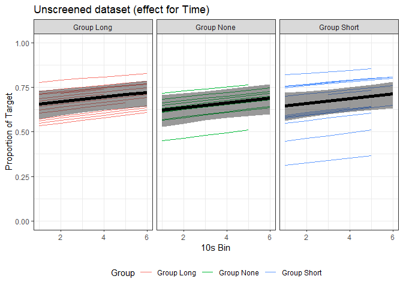
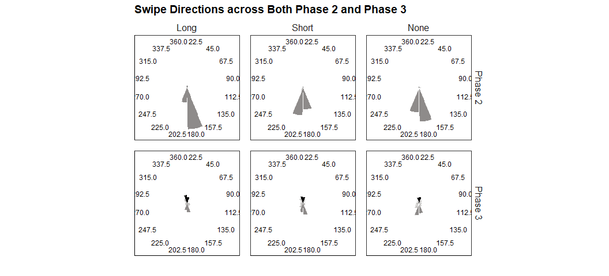
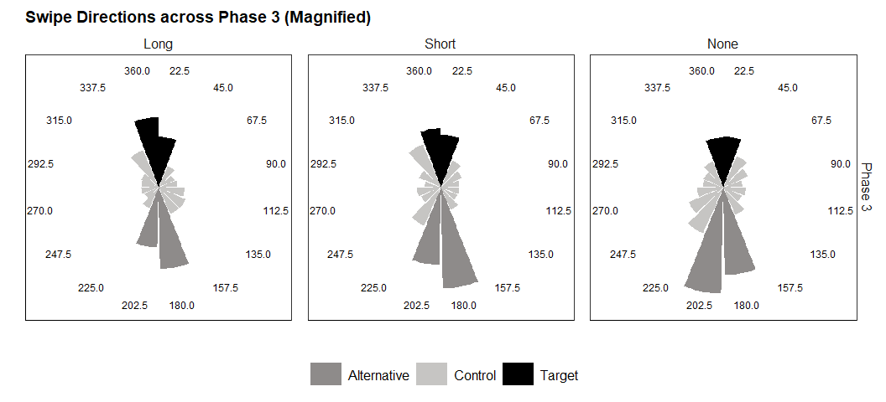
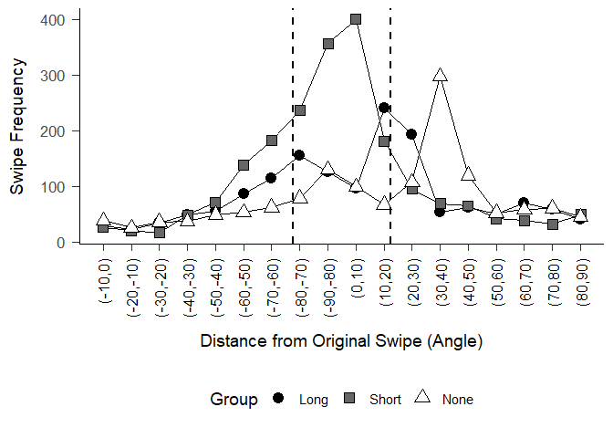
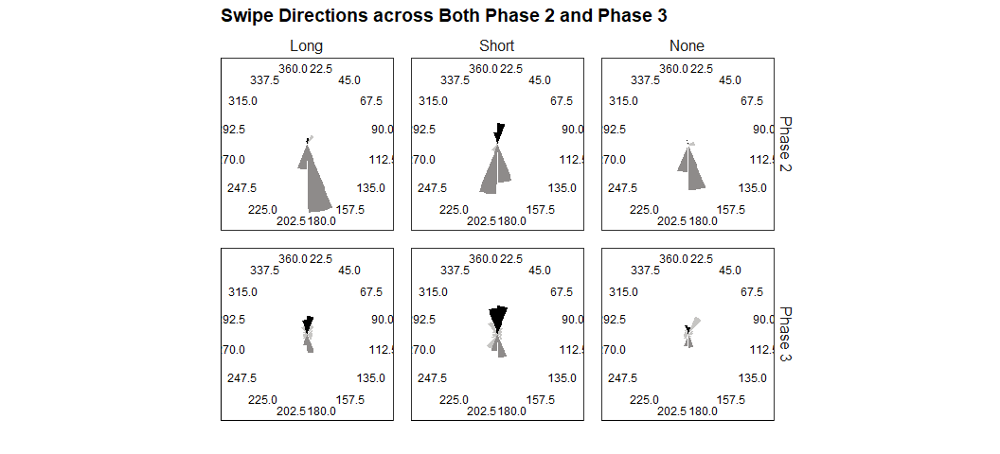

### RQ1: To what degree does the duration of target-reinforcement history in Phase 1 influence observed rates of resurgence as target responses as a proportion of previously reinforced responses (i.e., Target, Alternative)?

#### Screened Set

<table class="table" style="margin-left: auto; margin-right: auto;">
<caption>
RE Comparisons (RE.NO Selected)
</caption>
<thead>
<tr>
<th style="text-align:left;">
</th>
<th style="text-align:right;">
df
</th>
<th style="text-align:right;">
AICc
</th>
</tr>
</thead>
<tbody>
<tr>
<td style="text-align:left;">
RE.NO
</td>
<td style="text-align:right;">
7
</td>
<td style="text-align:right;">
-74.88479
</td>
</tr>
<tr>
<td style="text-align:left;">
RE.1
</td>
<td style="text-align:right;">
8
</td>
<td style="text-align:right;">
-69.56748
</td>
</tr>
<tr>
<td style="text-align:left;">
RE.2
</td>
<td style="text-align:right;">
10
</td>
<td style="text-align:right;">
-66.17144
</td>
</tr>
</tbody>
</table>

Model evaluations suggested that beta regression alone \[RE.NO\],
without random effects, best characterized the available data.

<table class="table" style="margin-left: auto; margin-right: auto;">
<caption>
FE Comparisons (FE.1 Selected, no interaction)
</caption>
<thead>
<tr>
<th style="text-align:left;">
</th>
<th style="text-align:right;">
df
</th>
<th style="text-align:right;">
AIC
</th>
</tr>
</thead>
<tbody>
<tr>
<td style="text-align:left;">
FE.0
</td>
<td style="text-align:right;">
7
</td>
<td style="text-align:right;">
-75.61207
</td>
</tr>
<tr>
<td style="text-align:left;">
FE.1
</td>
<td style="text-align:right;">
5
</td>
<td style="text-align:right;">
-79.36749
</td>
</tr>
</tbody>
</table>

<!-- -->

    ## 
    ## Call:
    ## betareg(formula = Proportion ~ Time + Group, data = database.organized, 
    ##     na.action = na.omit, link = "logit")
    ## 
    ## Standardized weighted residuals 2:
    ##     Min      1Q  Median      3Q     Max 
    ## -3.7438 -0.4991  0.0196  0.6503  2.1625 
    ## 
    ## Coefficients (mean model with logit link):
    ##                  Estimate Std. Error z value Pr(>|z|)   
    ## (Intercept)       0.52325    0.17497   2.991  0.00278 **
    ## Time              0.05883    0.03961   1.485  0.13748   
    ## GroupGroup None  -0.16552    0.16174  -1.023  0.30614   
    ## GroupGroup Short -0.06489    0.16459  -0.394  0.69337   
    ## 
    ## Phi coefficients (precision model with identity link):
    ##       Estimate Std. Error z value Pr(>|z|)    
    ## (phi)   4.7404     0.4873   9.728   <2e-16 ***
    ## ---
    ## Signif. codes:  0 '***' 0.001 '**' 0.01 '*' 0.05 '.' 0.1 ' ' 1 
    ## 
    ## Type of estimator: ML (maximum likelihood)
    ## Log-likelihood: 44.68 on 5 Df
    ## Pseudo R-squared: 0.02078
    ## Number of iterations: 18 (BFGS) + 2 (Fisher scoring)

#### Unscreened Set

Note: The AICc was close, but I prefer to go maximal (more complex)
whenever possible.

<table class="table" style="margin-left: auto; margin-right: auto;">
<caption>
RE Comparisons (RE.1 Selected)
</caption>
<thead>
<tr>
<th style="text-align:left;">
</th>
<th style="text-align:right;">
df
</th>
<th style="text-align:right;">
AICc
</th>
</tr>
</thead>
<tbody>
<tr>
<td style="text-align:left;">
RE.NO
</td>
<td style="text-align:right;">
7
</td>
<td style="text-align:right;">
-104.8066
</td>
</tr>
<tr>
<td style="text-align:left;">
RE.1
</td>
<td style="text-align:right;">
8
</td>
<td style="text-align:right;">
-115.2665
</td>
</tr>
<tr>
<td style="text-align:left;">
RE.2
</td>
<td style="text-align:right;">
10
</td>
<td style="text-align:right;">
-113.1423
</td>
</tr>
</tbody>
</table>
<table class="table" style="margin-left: auto; margin-right: auto;">
<caption>
FE Comparisons (FE.1 Selected, no interaction)
</caption>
<thead>
<tr>
<th style="text-align:left;">
</th>
<th style="text-align:right;">
df
</th>
<th style="text-align:right;">
AICc
</th>
</tr>
</thead>
<tbody>
<tr>
<td style="text-align:left;">
FE.0
</td>
<td style="text-align:right;">
8
</td>
<td style="text-align:right;">
-115.2665
</td>
</tr>
<tr>
<td style="text-align:left;">
FE.1
</td>
<td style="text-align:right;">
6
</td>
<td style="text-align:right;">
-126.0588
</td>
</tr>
</tbody>
</table>

<!-- -->

    ##  Family: beta  ( logit )
    ## Formula:          Proportion ~ Time + Group + (1 | UID)
    ## Data: database.organized
    ## 
    ##      AIC      BIC   logLik deviance df.resid 
    ##   -126.5   -106.4     69.2   -138.5      207 
    ## 
    ## Random effects:
    ## 
    ## Conditional model:
    ##  Groups Name        Variance Std.Dev.
    ##  UID    (Intercept) 0.2986   0.5464  
    ## Number of obs: 209, groups:  UID, 40
    ## 
    ## Overdispersion parameter for beta family (): 7.01 
    ## 
    ## Conditional model:
    ##                  Estimate Std. Error z value Pr(>|z|)   
    ## (Intercept)       0.56575    0.19892   2.844  0.00445 **
    ## Time              0.05979    0.03132   1.909  0.05631 . 
    ## GroupGroup None  -0.14614    0.25429  -0.575  0.56550   
    ## GroupGroup Short -0.04532    0.23718  -0.191  0.84847   
    ## ---
    ## Signif. codes:  0 '***' 0.001 '**' 0.01 '*' 0.05 '.' 0.1 ' ' 1

### RQ2: Does the duration of target-reinforcement history in Phase 1 contribute to different gradients of non-reinforced/control responding around targeted responding when undergoing extinction of alternative responding?

#### Screened Set

<!-- -->

<!-- --><!-- -->

<table class="table" style="margin-left: auto; margin-right: auto;">
<caption>
Reference Swipe \[Screened\]
</caption>
<thead>
<tr>
<th style="text-align:left;">
Group
</th>
<th style="text-align:right;">
Ave
</th>
<th style="text-align:right;">
sd
</th>
</tr>
</thead>
<tbody>
<tr>
<td style="text-align:left;">
Group Long
</td>
<td style="text-align:right;">
-0.4083333
</td>
<td style="text-align:right;">
11.96327
</td>
</tr>
<tr>
<td style="text-align:left;">
Group Short
</td>
<td style="text-align:right;">
0.2309142
</td>
<td style="text-align:right;">
11.64014
</td>
</tr>
<tr>
<td style="text-align:left;">
Group None
</td>
<td style="text-align:right;">
-0.2140871
</td>
<td style="text-align:right;">
11.83293
</td>
</tr>
</tbody>
</table>
<table class="table" style="margin-left: auto; margin-right: auto;">
<caption>
Levenes Test \[Screened\]
</caption>
<thead>
<tr>
<th style="text-align:right;">
statistic
</th>
<th style="text-align:right;">
p.value
</th>
<th style="text-align:right;">
df
</th>
<th style="text-align:right;">
df.residual
</th>
</tr>
</thead>
<tbody>
<tr>
<td style="text-align:right;">
0.42065
</td>
<td style="text-align:right;">
0.6566574
</td>
<td style="text-align:right;">
2
</td>
<td style="text-align:right;">
3097
</td>
</tr>
</tbody>
</table>

#### Unscreened Set

<!-- -->

<!-- --><!-- -->

<table class="table" style="margin-left: auto; margin-right: auto;">
<caption>
Reference Swipe \[Unscreened\]
</caption>
<thead>
<tr>
<th style="text-align:left;">
Group
</th>
<th style="text-align:right;">
Ave
</th>
<th style="text-align:right;">
sd
</th>
</tr>
</thead>
<tbody>
<tr>
<td style="text-align:left;">
Group Long
</td>
<td style="text-align:right;">
1.6585535
</td>
<td style="text-align:right;">
12.86927
</td>
</tr>
<tr>
<td style="text-align:left;">
Group Short
</td>
<td style="text-align:right;">
-0.0391621
</td>
<td style="text-align:right;">
10.99179
</td>
</tr>
<tr>
<td style="text-align:left;">
Group None
</td>
<td style="text-align:right;">
-0.4386266
</td>
<td style="text-align:right;">
11.74291
</td>
</tr>
</tbody>
</table>
<table class="table" style="margin-left: auto; margin-right: auto;">
<caption>
Levenes Test \[Unscreened\]
</caption>
<thead>
<tr>
<th style="text-align:right;">
statistic
</th>
<th style="text-align:right;">
p.value
</th>
<th style="text-align:right;">
df
</th>
<th style="text-align:right;">
df.residual
</th>
</tr>
</thead>
<tbody>
<tr>
<td style="text-align:right;">
42.61284
</td>
<td style="text-align:right;">
0
</td>
<td style="text-align:right;">
2
</td>
<td style="text-align:right;">
4796
</td>
</tr>
</tbody>
</table>
